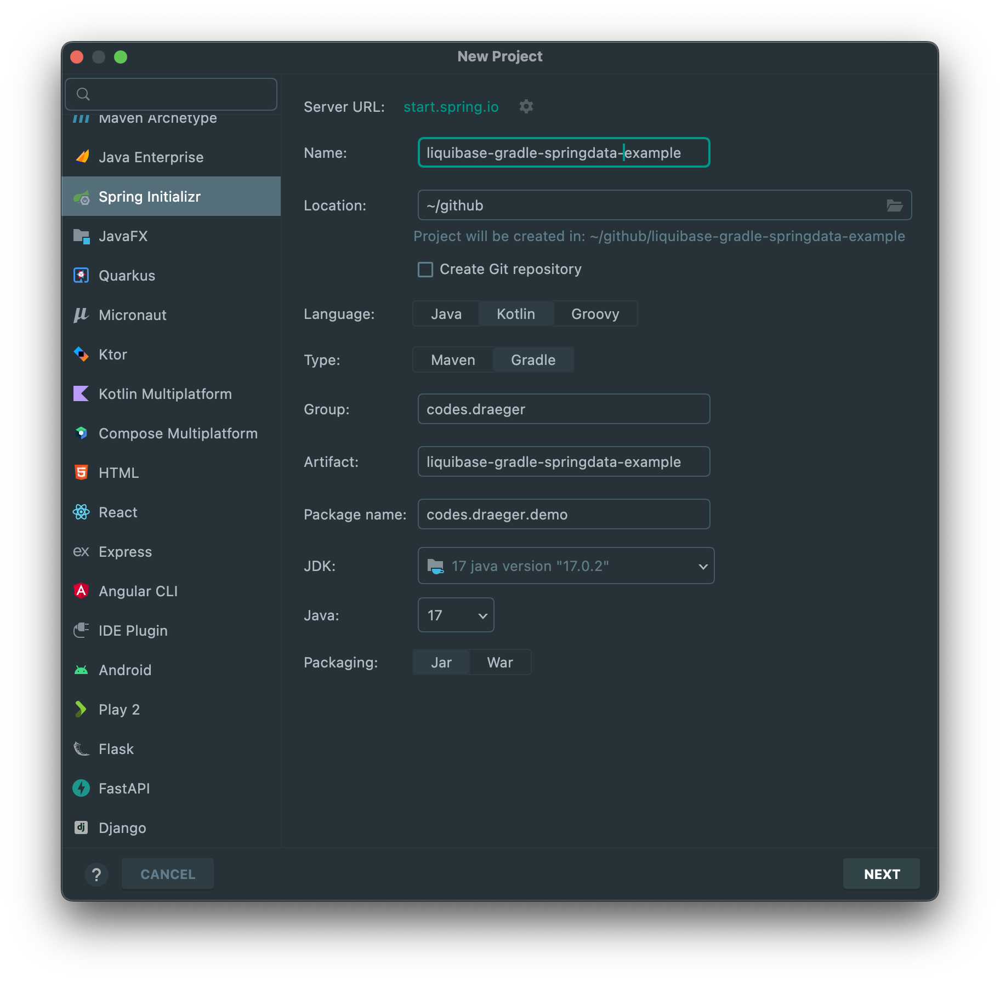
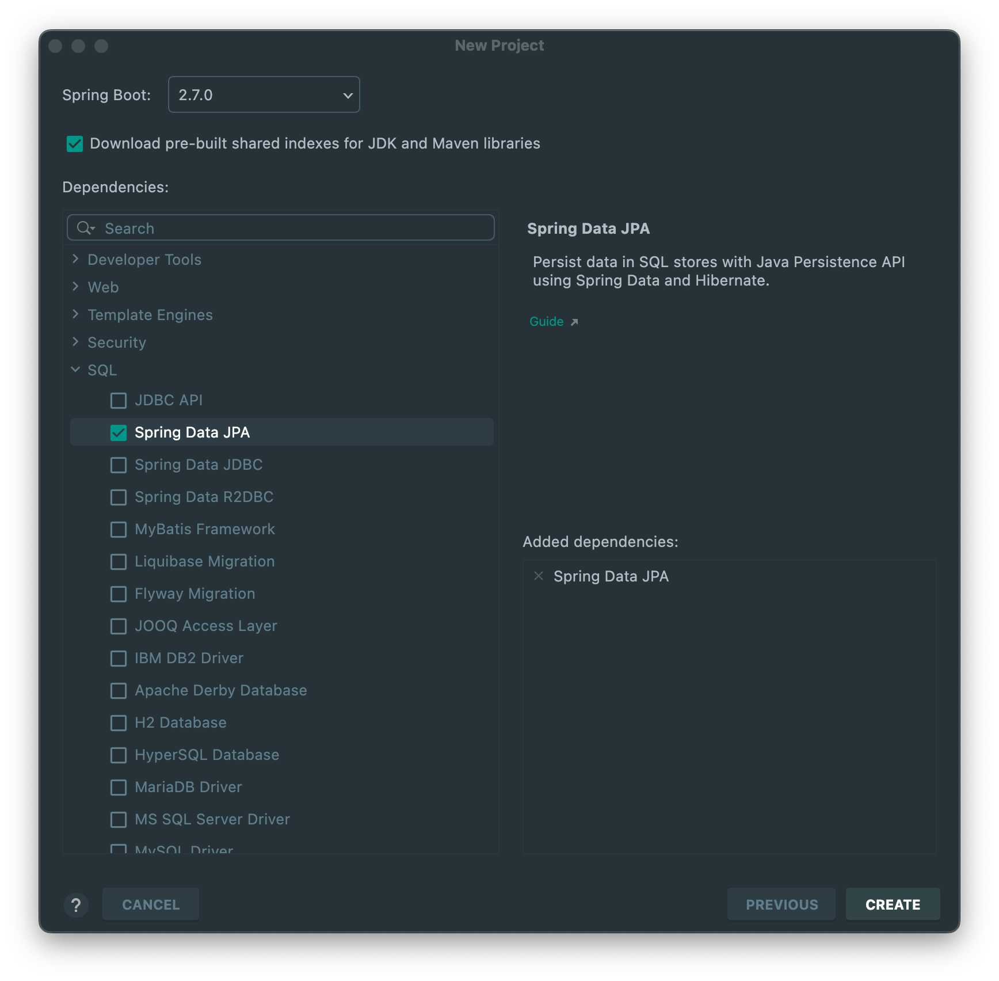
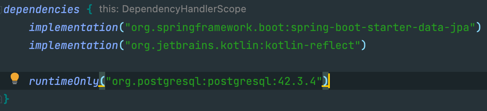
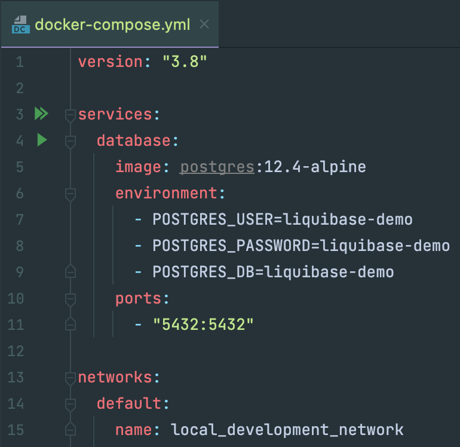
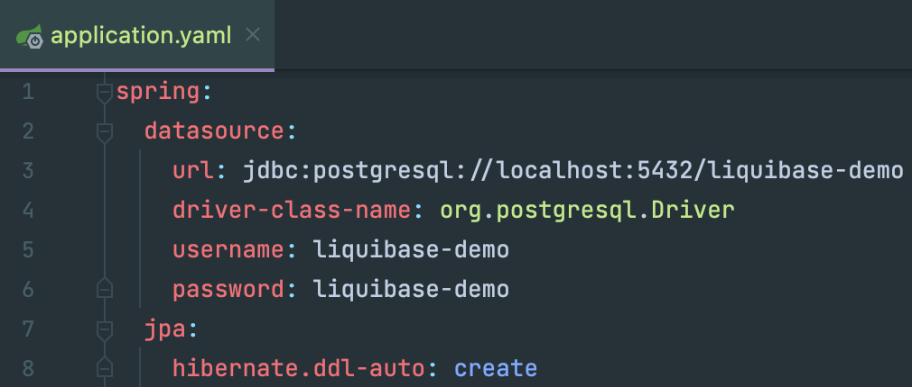
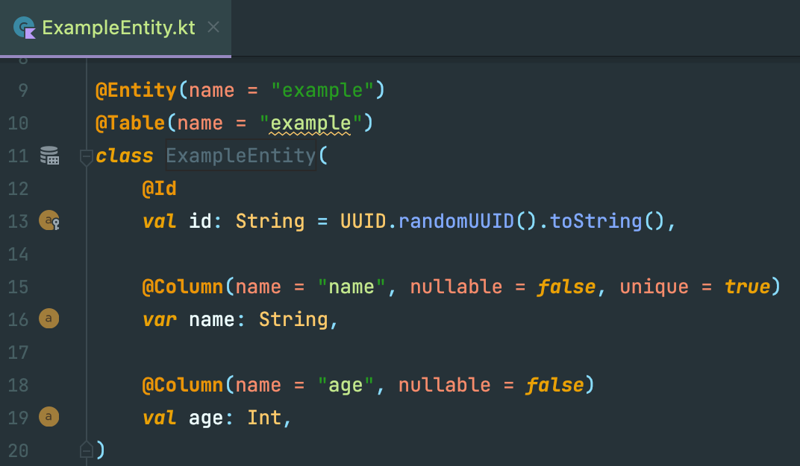
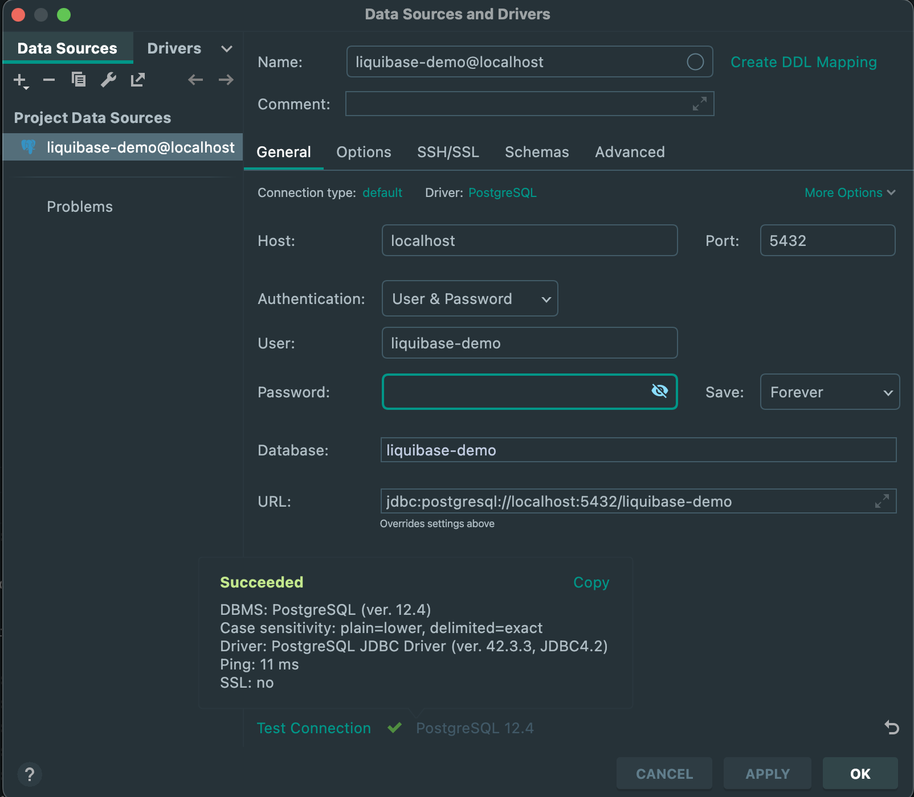
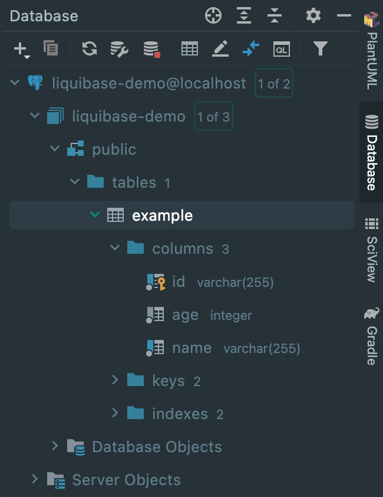

Liquibase via Gradle Demo 
=========================

This is an example project to show-case how to set up liquibase using the [liquibase-gradle-plugin](https://github.com/liquibase/liquibase-gradle-plugin) in a spring-boot project.
The Example project is completely written in Kotlin, uses [spring-data-jpa](https://spring.io/projects/spring-data-jpa) (and thereby hibernate under the hood) and a Postgres database.

Its aim is to provide a minimal step-by-step guide that demonstrates what is needed to be able to generate an initial schema as well as generate liquibase changelog diffs automatically based on your JPA entities.

> Hint: you already have a spring-boot project that uses JPA --> jump directly over to step 3 

## Step 1
Generate a new spring-boot project that uses spring-data-jpa using [spring initializr](https://start.spring.io).

 

## Step 2
Adding a database and an entity to the project.
In this example we will spin up a Postgres database using [docker compose](docker-compose.yml), but it will also work with any other database that is supported by spring-data-jpa and liquibase.

### Step 2.1
Add postgres driver as a runtime dependency to your projects build.gradle.kts.

### Step 2.2
Add docker-compose file to be able to conveniently spin up a postgres database on your local machine.

### Step 2.3
Connect Spring Boot app with database (TODO: few words about driver and ddl)

### Step 2.4
Add an Entity.
> Hint: since we use the jpa option `spring.jpa.hibernate.ddl-auto: create` in our [application.yaml](src/main/resources/application.yaml) Hibernate first drops existing tables, then creates new tables based on the Entities (classes annotated with `@Entity`) of our project!
> Accordingly this property will influence how the schema tool management will manipulate the database schema at startup.

A few words about JPA Entities and how to use them correctly in Kotlin or why you should always use classes - **NEVER use `data class` as an Entity!**

| **Kotlin Data Class**                                                                                                                                                                                                                                           | **Hibernate Requirements for Entity classes**                                                                                                           |
|-----------------------------------------------------------------------------------------------------------------------------------------------------------------------------------------------------------------------------------------------------------------|---------------------------------------------------------------------------------------------------------------------------------------------------------|
| According to the [official kotlin docs](https://kotlinlang.org/docs/data-classes.html) a Data classes cannot be open (is final / immutable)                                                                                                                     | using auto-generated IDs means an entity class needs to be mutable to work properly                                                                     |
| will generate `equals` and `hashCode` functions based on the properties declared in the primary constructor on instantiation                                                                                                                                    | needs to provide useful implementations for `equals` and `hashCode`. The `hashCode`s entity identifier may be set after the object has been constructed |
| will create getters by using `val` properties (which means those values are final)                                                                                                                                                                              | persistent instance variables of the entity should not be final                                                                                         |
| You cannot extend a Data class or make it abstract. This limitation is not Kotlin’s fault. There is no way to generate the correct value-based `equals()` without violating the Liskov Principle. That’s why Kotlin doesn’t allow inheritance for Data classes. | may extend non-entity classes **as well as entity classes**                                                                                             |
| will only have a primary no-args constructor if all parameters have a default value                                                                                                                                                                             | must have a public or protected (or package-private) no-argument constructor                                                                            |
| equals(), hashCode() and toString() implementations use all fields from the primary constructor (regardless of its annotations, e.g. an association to another entity with `FetchType.LAZY`)                                                                    | calling properties with `FetchType.LAZY` on every `toString()` call results in unwanted requests to the DB or a LazyInitializationException             |

The official spring guide summarizes this dilemma as follows: "don’t use data classes with val properties because **JPA is not designed to work with immutable classes or the methods generated automatically by data classes**." 
  * BTW: other spring-data flavors such as Spring Data MongoDB, Spring Data JDBC, etc. support such constructs, you are free to use data classes there

Further reading: [video webinar](https://www.youtube.com/watch?v=a_6V8xwiv04), [blog post](https://www.jpa-buddy.com/blog/best-practices-and-common-pitfalls/), [blog post](https://kotlinexpertise.com/hibernate-with-kotlin-spring-boot/), [blog post](https://dzone.com/articles/kotlin-data-classes-and-jpa), 

### Step 2.5
Verify if spring boot app will connect to database and hibernate auto-generates a database schema
* start postgres database with following command executed from your projects root directory: `docker compose up`
* run spring-boot app `./gradlew bootRun`
* connect to database using any database client (i am using intellij here)
    * 
* check if schema was automatically generated by hibernate dll
    * 

